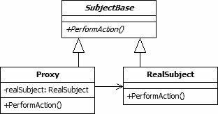

# Proxy Design Pattern

The proxy pattern is a design pattern that creates a surrogate, or placeholder class. Proxy instances accept requests from client objects, pass them to the underlying object and return the results. Proxies can improve efficiency and enhance functionality.

## What is the Proxy Pattern?

The proxy pattern is a Gang of Four design pattern. This is a structural pattern as it defines a manner for creating relationships between classes or entities. The proxy design pattern is used to provide a surrogate or placeholder object, which references an underlying object. The proxy provides the same public interface as the underlying subject class. It adds a level of indirection by accepting requests from a client object and passing these to the real subject object as necessary. This can improve the efficiency of access to objects that you do not wish to access directly, perhaps because they are slow to execute or are resource-intensive, or because you wish to add extra functionality.

There are many uses for the proxy design pattern. Five of the more common types of proxy are:

- **Cache Proxy**: A cache proxy improves the performance of the underlying object's members when they perform long-running tasks that return seldom-changing results. For example, the underlying object may provide a method that calculates prime numbers. When the first call to the proxy's matching method is made, the call is passed to the real object. The results from the call are stored within the proxy object and returned to the client. For subsequent calls, the cached information in the proxy can be returned without recalculating the prime numbers.
- **Protection Proxy**: A protection proxy adds a layer of security to the underlying subject object. For example, the real object may access a database and retrieve sensitive data. The protection proxy could add methods or properties that allow the client object to provide appropriate authentication before allowing the data to be returned. It could also filter the data according to the rights of the authenticated user.
- **Remote Proxy**: A remote proxy provides a local object that references a subject object in another location, generally via a network connection. The proxy performs the required actions to encode the requests for network transfer and accept the results from the remote resource before returning them to the client. A common example of a remote proxy is the local class generated by Visual Studio to provide access to a web service.
- **Smart Proxy**: Smart proxies add extra functionality to the calls to the real object's members. This functionality is often invisible to the client object. For example, counting the existing references to a resource-intensive object so that when the counter reaches zero the object's data can be removed from memory. You could also use a smart proxy to log calls to the underlying object's members.
- **Virtual Proxy**: A virtual proxy provides a simplified version of a complex object. Only when the detail of the object is required is the main object actually populated, providing a form of lazy initialization. For example, a file management utility such as Windows Explorer may use an object for each file that is visible on the screen. When obtaining the file list, the file name, size and other easy-to-retrieve information would be held in proxy objects. Only when the "document preview" command is requested would the real object be created and populated with the full contents of the file, as these are slower to access and require more memory.

## Implementing the Proxy Pattern

The UML class diagram above describes an implementation of the proxy design pattern. The items in the diagram are described below:

The diagram shows three classes:

1. **SubjectBase**: This abstract class serves as the base class for both the proxy and its underlying subject object. It defines any standard members that will be implemented by proxy classes and real subject classes. If you do not wish to create any actual functionality in this class, you may decide to create it as an interface instead.

2. **RealSubject**: This class represents the complex or resource-hungry class that we wish to use more efficiently.

3. **Proxy**: This class is the key to the design pattern. Objects of this type hold a private instance of a real subject object as required. Client objects execute actions on the proxy that are passed to the RealSubject object. The results from the RealSubject's members are returned to the client via the proxy.